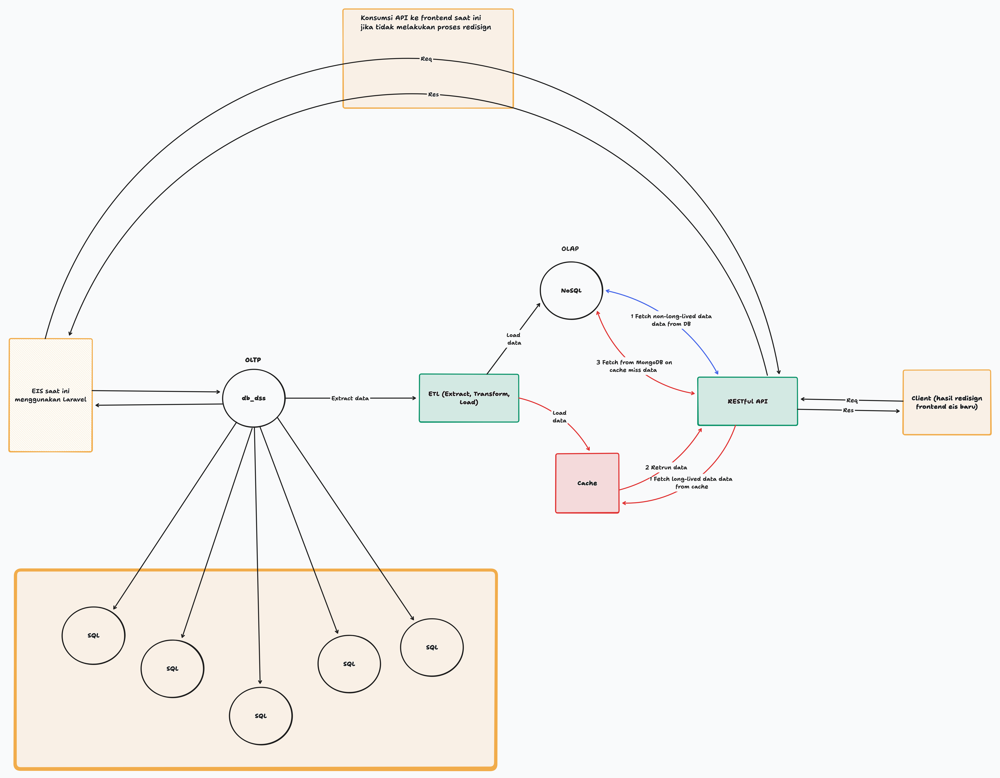
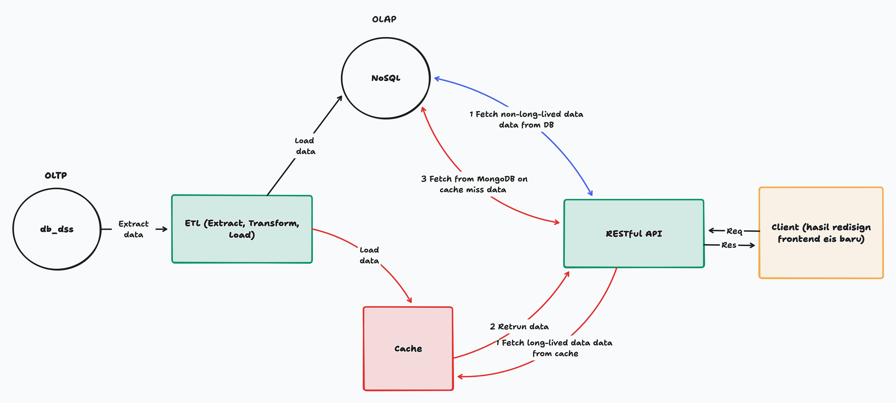

# 📊 Executive Information System (EIS) - Undiksha (Backend API)


This repository contains the **RESTful API** for the **Executive Information System (EIS) Undiksha**, built with **Golang** using the **Gin framework**.
The API consumes data from **MongoDB** (populated via ETL from SQL in a separate repository) and uses **Redis** for caching.
The system is integrated with **Undiksha Single Sign-On (SSO)** and implements **JWT Authentication** for secure access.

---

## 🚀 Tech Stack

- **Backend:** Golang + Gin
- **Database:** MongoDB
- **Cache:** Redis
- **Auth:** Undiksha SSO + JWT
- **Deployment:** Docker & Docker Compose

---

## 🛠️ Key Features

- 🔑 Secure authentication using **SSO + JWT**
- ⚡ Improved performance with **Redis caching**
- 📡 **RESTful API** serving multiple frontends
- 🧩 Modular and maintainable project structure

---

## 📐 System Architecture




---

## 📦 Installation & Setup

### Prerequisites

Make sure you have installed:

- [Go 1.22+](https://golang.org/dl/)
- [MongoDB 5.0+](https://www.mongodb.com/try/download/community)
- [Redis 6.0+](https://redis.io/download)
- [Git](https://git-scm.com/downloads)
- [Docker & Docker Compose](https://docs.docker.com/get-docker/) _(optional but recommended)_

### Setup & Run

```bash
# Clone repository
git clone https://github.com/anggananda/restapi-golang.git
cd restapi-golang

# Copy environment variables
cp .env.example .env

#fill in the environment variables
MONGO_URI=
MONGO_DB=
CAS_URL=
REDIS_HOST=
REDIS_PORT=
REDIS_DB=
REDIS_PASSWORD=
FRONTEND_URL=
HOST_URL=
APP_HOST=
APP_SCHEME=
ALLOWED_ORIGINS=
JWT_SECRET_KEY=
UNIT_KERJA=

# --- Local Development ---

# Install dependencies
go mod tidy

# Run in development mode
go run main.go

# Or build binary and run
go build -o eis-api
./eis-api

# Test health check
curl http://localhost:8080/api/v1/health-check

# --- Docker Setup ---

# Start docker services
docker compose up -d

# View logs
docker compose logs -f

# Stop docker services
docker compose down
```

## 📂 Struktur Project

```bash
.
├── assets/
├── config/
├── constants/
├── docs/
├── handlers/
├── interfaces/
├── middlewares/
├── mocks/
├── models/
├── repositories/
├── routes/
├── services/
├── tests/
│   └── mocks/
│   └── units/
├── utils/
├── main.go
├── docker-compose.yml
├── Dockerfile
├── go.mod
├── go.sum
├── .gitignore
├── .env.example
└── README.md
```
